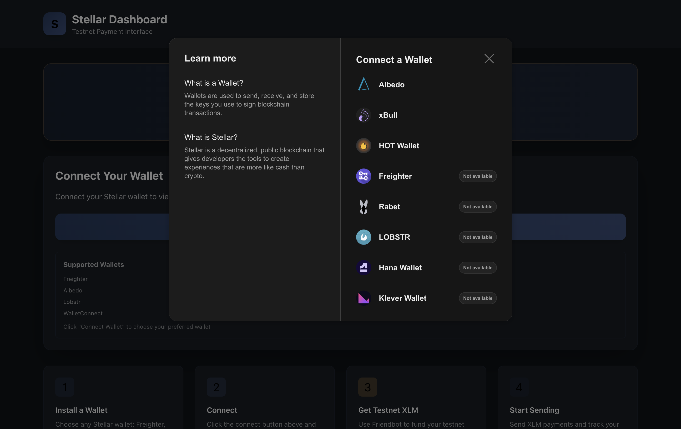
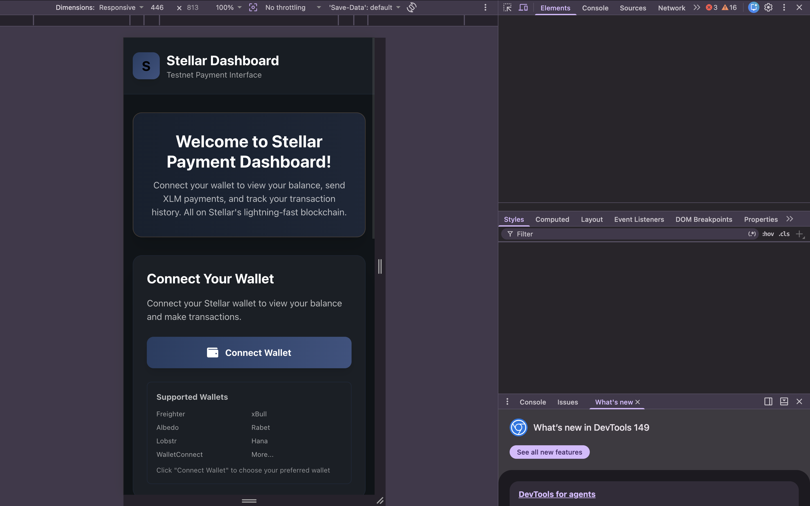
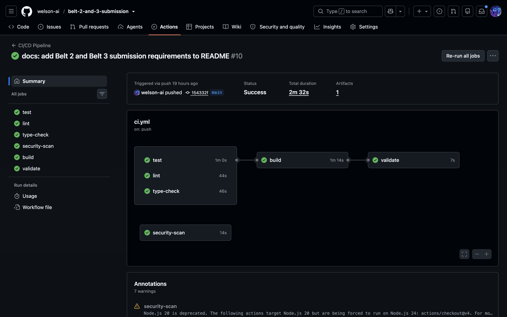
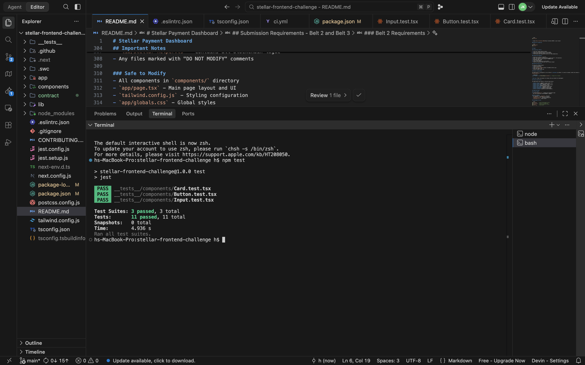

# Invoforge

## Submission Requirements - Belt 2 and Belt 3
#### demo video
https://www.veed.io/view/e620ffa7-b4eb-49e4-9991-f6cf675dc8a9?source=editor&panel=share
#### Contract deployment address
CCCVBY3SCHOWYSGNCBFIT46CTBX2A6OD6U5344JGMZO47ZRJRVN4MBM4
#### Transaction hash for contract interaction
fbd578e17392209a4b7a8f0d403df5e02542e1fc86398c03750643a594f31cd0
#### Live demo link
https://bstellar-pay.vercel.app/

#### Screenshot: wallet options available


#### Mobile responsive UI



#### CI/CD pipeline running



#### Test output with 3+ passing tests




## Project Overview

This project is Invoforge, a payment dashboard that allows users to connect their wallet, view their balance, send XLM payments, and track transaction history. The application runs on Stellar's testnet and features a modern dark-themed UI.

## Tech Stack

- **Framework**: Next.js 14.2.0 (React 18.3.1)
- **Language**: TypeScript 5.4.5
- **Styling**: Tailwind CSS 3.4.4
- **Blockchain**: Stellar SDK 12.3.0
- **Wallet Integration**: Stellar Wallets Kit 1.9.5
- **Icons**: React Icons 5.0.1
- **Smart Contract**: Soroban SDK (soroban-client, @stellar/freighter-api)

## Project Structure

```
invoforge/
├── app/                          # Next.js app directory
│   ├── globals.css             # Global styles and Tailwind directives
│   ├── layout.tsx              # Root layout component
│   └── page.tsx                # Main page component
├── components/                  # React components
│   ├── BalanceDisplay.tsx      # Balance display with refresh functionality
│   ├── BonusFeatures.tsx       # Placeholder components for bonus features
│   ├── PaymentForm.tsx         # Payment form with validation
│   ├── TransactionHistory.tsx   # Transaction history component
│   ├── WalletConnection.tsx    # Wallet connection/disconnection
│   └── example-components.tsx  # Reusable UI components (Card, Input, Button, etc.)
├── lib/                        # Utility libraries
│   ├── stellar-helper.ts       # Stellar blockchain logic (DO NOT MODIFY)
│   └── contract.ts            # Soroban smart contract service
├── smart-contract/             # Soroban smart contract
│   ├── Cargo.toml             # Rust package configuration
│   └── src/
│       └── lib.rs              # Soroban contract code
├── tailwind.config.js          # Tailwind CSS configuration with Stellar colors
├── tsconfig.json               # TypeScript configuration
├── next.config.js              # Next.js configuration
├── package.json                # Project dependencies and scripts
└── postcss.config.js           # PostCSS configuration
```

## Architecture

### Component Architecture

The application follows a hierarchical component structure with clear separation of concerns:

```
app/page.tsx (Main Container)
├── WalletConnection
│   ├── Connect/Disconnect Logic
│   ├── Address Display
│   └── Copy to Clipboard
├── BalanceDisplay
│   ├── XLM Balance
│   ├── Other Assets
│   └── Refresh Functionality
├── PaymentForm
│   ├── Form Validation
│   ├── Payment Submission
│   └── Transaction Confirmation
└── TransactionHistory
    ├── Transaction List
    ├── Transaction Details
    └── Refresh Functionality
```

### Data Flow

1. **Wallet Connection Flow**:
   - User clicks "Connect Wallet" → `WalletConnection` component
   - Opens wallet modal via `StellarWalletsKit`
   - Returns public key → Updates parent state
   - Triggers balance and transaction fetch

2. **Payment Flow**:
   - User fills form → `PaymentForm` validates input
   - Calls `stellar.sendPayment()` → `stellar-helper.ts`
   - Signs transaction via wallet
   - Submits to Stellar network
   - Returns transaction hash → Updates UI

3. **Balance/Transaction Flow**:
   - Component mounts → Calls `stellar.getBalance()` or `stellar.getRecentTransactions()`
   - Fetches from Stellar Horizon API
   - Updates component state
   - Displays formatted data

### Blockchain Integration Layer

The `lib/stellar-helper.ts` file contains all blockchain logic and should NOT be modified:

- **StellarHelper Class**: Main blockchain interaction class
- **Wallet Connection**: Uses Stellar Wallets Kit for wallet integration
- **Balance Retrieval**: Fetches XLM and custom asset balances
- **Payment Processing**: Handles transaction creation, signing, and submission
- **Transaction History**: Retrieves recent transactions from Horizon API
- **Explorer Integration**: Generates links to Stellar Expert

### Smart Contract Integration

The frontend is integrated with a deployed Soroban smart contract on Stellar testnet:

**Contract Details:**
- **Contract ID**: CCCVBY3SCHOWYSGNCBFIT46CTBX2A6OD6U5344JGMZO47ZRJRVN4MBM4
- **Network**: Stellar Testnet
- **RPC URL**: https://soroban-testnet.stellar.org

**Integration Architecture:**

1. **Contract Service (`lib/contract.ts`)**:
   - Uses Stellar SDK with Soroban RPC for contract interaction
   - Uses Freighter API for wallet connection and transaction signing
   - Provides `recordPayment()` function for recording transactions
   - Provides `getTransactionCount()` function for reading contract state
   - Automatically captures transaction hash from contract invocations
   - Implements transaction confirmation polling
   - Returns explorer URLs for transaction viewing

2. **Contract Functions Available:**
   - `record_payment(from, to, amount, asset)` - Record payment transaction
   - `get_transaction_count()` - Get total transaction count
   - Other contract functions available but not yet integrated in UI

3. **UI Integration (`components/ContractStats.tsx`)**:
   - Displays contract transaction count
   - Shows recent transaction with hash and status
   - Displays transaction hash as clickable link to Stellar Expert
   - Provides refresh functionality
   - Integrated into main dashboard when wallet is connected

4. **Transaction Flow:**
   - User connects wallet via Freighter API
   - Contract service builds transaction using Stellar SDK
   - Transaction is simulated via Soroban RPC
   - Transaction is signed by Freighter wallet
   - Signed transaction is submitted to Soroban network
   - Transaction hash is captured from response
   - System polls for transaction confirmation
   - Transaction hash is displayed as explorer link

5. **Transaction Hash Display:**
   - Hash is automatically returned when contract is invoked
   - Displayed as clickable link: `https://stellar.expert/explorer/testnet/tx/{txHash}`
   - Status is shown (SUCCESS, PENDING, FAILED)
   - Confirmation polling ensures transaction is confirmed

6. **Dependencies:**
   - `@stellar/stellar-sdk` - Core Stellar SDK for blockchain interaction
   - `@stellar/freighter-api` - Freighter wallet integration
   - Soroban RPC server for contract interaction

**Transaction Hash for Contract Interaction:**
4dc65ecf9334d86c0127be3e9c512b0143b837d02877f0db99ad735a3e358200

### Styling Architecture

The project uses a custom Invoforge color palette defined in `tailwind.config.js`:

```javascript
invoforge: {
  primary: '#6366f1',           // Primary indigo
  secondary: '#8b5cf6',        // Secondary purple
  accent: '#f59e0b',            // Amber accent
  success: '#10b981',          // Green success
  danger: '#ef4444',            // Red danger
  background: '#0f0f1a',        // Deep dark background
  surface: '#1a1a2e',           // Surface elements
  'surface-hover': '#252542',   // Surface hover state
}
```

## Components

### Core Components

#### WalletConnection
- Handles wallet connection/disconnection
- Displays connected address with copy functionality
- Shows supported wallets list
- Provides link to Stellar Expert

#### BalanceDisplay
- Shows XLM balance with formatting
- Displays other assets (if present)
- Includes USD estimate (placeholder)
- Refresh functionality with loading states

#### PaymentForm
- Input fields for recipient address, amount, and optional memo
- Form validation for Stellar addresses and amounts
- Success/error handling with user-friendly messages
- Transaction confirmation display with explorer link

#### TransactionHistory
- Lists recent transactions (limit: 10)
- Shows transaction type, amount, from/to addresses
- Relative time formatting (e.g., "2m ago", "1h ago")
- Links to Stellar Expert for transaction details
- Empty state when no transactions exist

### Reusable Components (example-components.tsx)

- **Card**: Container component with consistent styling
- **Input**: Form input with label and error handling
- **Button**: Button with multiple variants (primary, secondary, danger)
- **Alert**: Success/error/info alert messages
- **EmptyState**: Placeholder for empty states
- **Modal**: Modal component for overlays
- **CopyButton**: Copy to clipboard functionality
- **LoadingSpinner**: Loading animation

### Bonus Features (BonusFeatures.tsx)

Placeholder components for potential enhancements:
- **ThemeToggle**: Dark/light mode switching
- **AddressQRCode**: QR code generation for addresses
- **BalanceChart**: Balance history visualization
- **TransactionFilter**: Search/filter transactions
- **TransactionConfirmation**: Payment confirmation modal
- **AddressBook**: Save and manage contact addresses
- **AnimatedCard**: Animation utilities

## Features

### Current Features
- Wallet connection with multiple wallet support
- Balance display with refresh functionality
- XLM payment sending with memo support
- Transaction history with explorer links
- Form validation and error handling
- Responsive design
- Stellar brand color scheme
- Loading states and animations
- Copy to clipboard functionality

### Bonus Features (To Implement)
- Dark/light mode toggle
- QR code for wallet address
- Balance chart/graph
- Transaction search/filter
- Transaction confirmation modal
- Address book
- Enhanced animations

## Setup Instructions

### Prerequisites
- Node.js 18+ installed
- npm or yarn package manager
- Stellar wallet (Freighter, xBull, Lobstr, etc.)

### Installation

1. Clone the repository:
```bash
git clone <repository-url>
cd stellar-frontend-challenge
```

2. Install dependencies:
```bash
npm install
```

3. Run the development server:
```bash
npm run dev
```

4. Open [http://localhost:3000](http://localhost:3000) in your browser

### Build for Production

```bash
npm run build
npm start
```

## Usage

### Connecting a Wallet

1. Click the "Connect Wallet" button
2. Select your preferred wallet from the modal
3. Approve the connection request in your wallet
4. Your balance and transaction history will load automatically

### Sending XLM Payments

1. Ensure your wallet is connected
2. Enter the recipient's Stellar address (starts with 'G', 56 characters)
3. Enter the amount in XLM (minimum: 0.0000001 XLM)
4. Optionally add a memo
5. Click "Send Payment"
6. Confirm the transaction in your wallet
7. View the transaction hash and link to Stellar Expert

### Getting Testnet XLM

To fund your testnet account:
1. Connect your wallet
2. Copy your public key
3. Visit [Stellar Friendbot](https://friendbot.stellar.org/)
4. Paste your public key
5. Receive 10,000 testnet XLM

## Network Configuration

The application is configured to run on Stellar's **testnet** by default. To switch to mainnet, modify the network parameter in `lib/stellar-helper.ts`:

```typescript
const stellar = new StellarHelper('mainnet'); // Change from 'testnet'
```

**Warning**: Never use mainnet for testing. Only use testnet for development.

## Stellar Brand Colors

The application uses a custom Invoforge color palette defined in `tailwind.config.js`:

- **Invoforge Primary**: #6366f1 (primary indigo)
- **Invoforge Secondary**: #8b5cf6 (secondary purple)
- **Invoforge Accent**: #f59e0b (amber accent)
- **Invoforge Success**: #10b981 (green success)
- **Invoforge Danger**: #ef4444 (red danger)
- **Invoforge Background**: #0f0f1a (deep dark background)
- **Invoforge Surface**: #1a1a2e (surface elements)
- **Invoforge Surface Hover**: #252542 (surface hover state)

## Important Notes

### DO NOT MODIFY
- `lib/stellar-helper.ts` - Contains all blockchain logic
- Any files marked with "DO NOT MODIFY" comments

### Safe to Modify
- All components in `components/` directory
- `app/page.tsx` - Main page layout and UI
- `tailwind.config.js` - Styling configuration
- `app/globals.css` - Global styles

## Development Scripts

```bash
npm run dev      # Start development server
npm run build    # Build for production
npm start        # Start production server
npm run lint     # Run ESLint
```

## Browser Support

- Chrome (latest)
- Firefox (latest)
- Safari (latest)
- Edge (latest)

## License

This project is Invoforge.

## Resources

- [Stellar Documentation](https://developers.stellar.org/)
- [Stellar SDK](https://github.com/stellar/js-stellar-sdk)
- [Stellar Wallets Kit](https://github.com/creit-tech/stellar-wallets-kit)
- [Next.js Documentation](https://nextjs.org/docs)
- [Tailwind CSS](https://tailwindcss.com/docs)

## Support

For issues or questions related to:
- **UI/UX**: Modify components in the `components/` directory
- **Blockchain Logic**: Contact challenge organizers (do not modify `stellar-helper.ts`)
- **Stellar Network**: Check [Stellar Status](https://status.stellar.org/)

---

**Built with Stellar SDK | Invoforge Dashboard | Running on Testnet**
